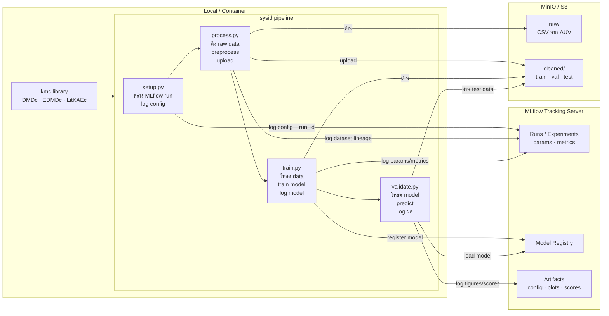

# AUV System Identification Pipeline

Training and validation pipeline for data-driven system identification of an autonomous underwater vehicle (AUV) using Koopman operator methods from the `kmc` library.

## Models
- DMDc — Dynamic Mode Decomposition with control
- EDMDc — Extended Dynamic Mode Decomposition with control
- Deep Koopman with control (DKC / DKC-PINN)

## Structure
```
sysid/
├── config/              # Experiment configs (model, data, features)
│   ├── kaec/            # Koopman-based model configs
│   └── physics/         # Physics-informed configs
├── notebook/            # ETL prototype notebook
├── container/           # Container definitions
│   ├── Dockerfile
│   └── singularity.def
├── script/              # Entry-point scripts
│   ├── setup.py         # Create MLflow run and log config
│   ├── process.py       # Fetch and preprocess data
│   ├── train.py         # Train model
│   ├── validate.py      # Evaluate and log results
│   └── utils/           # Shared helpers (data loading, metrics)
└── run_local.sh         # Run full pipeline locally
```

## Architecture



## Prerequisites
- Python 3.10+
- `kmc` package installed (`pip install -e .` from repo root)
- `.env` file with MLflow and S3 credentials (see below)

## Getting Started

1. Clone the repo and install the package:
    ```bash
    git clone <repo-url>
    cd kmc
    pip install -e .
    ```

2. Create a `.env` file inside `sysid/`:
    ```
    MLFLOW_TRACKING_URI=...
    S3_ENDPOINT_URL=...
    S3_ACCESS_KEY_ID=...
    S3_SECRET_ACCESS_KEY=...
    ```

3. Run the full pipeline from `sysid/`:
    ```bash
    cd sysid
    bash run_local.sh
    ```

## Docker

Build and run with GPU support:
```bash
cd kmc
docker build -f sysid/container/Dockerfile -t kmc-sysid .
docker run --gpus all -it --rm -v $(pwd)/sysid:/workspace kmc-sysid
bash run_local.sh
```
